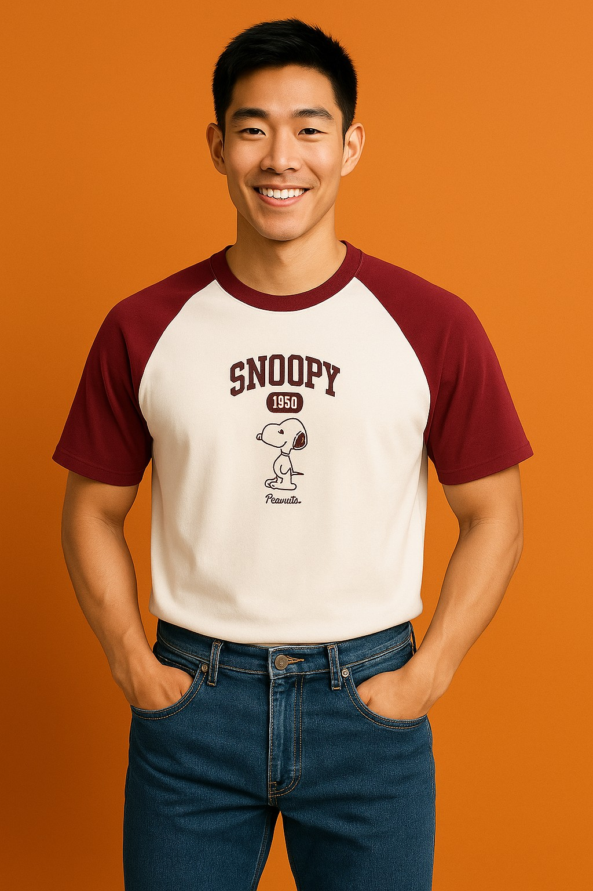

# 🎨 AI Virtual Try-On System

AI-powered virtual try-on system using OpenAI's image generation models. **Specialized for upper clothing** (shirts, jackets, tops) with automatic clothing detection and validation through multi-agent collaboration.

## ✨ Features

- 🤖 **Multi-Agent Architecture**: Model generation, clothing merge, and clothing validation agents
- 👕 **Upper Clothing Only**: Specifically designed for upper clothing try-on (shirts, jackets, tops, etc.)
- 🔍 **Smart Clothing Detection**: AI agents automatically identify and validate upper clothing items
- 🎯 **Customizable Models**: Control gender, age, nationality, height, weight and other parameters
- 📸 **Multiple Angles**: Support full-body/half-body shots from front/side angles
- 🚀 **One-Click Launch**: Automated deployment with LAN access

## 🖼️ Demo Results

### Complete Try-On Process
| Original Clothing | Generated Model | Final Try-On Result |
|-------------------|-----------------|---------------------|
|  |  |  |
|  |  |  |
|  |  |  |

## 🚀 Quick Start

### Requirements
- Python 3.8+
- Node.js & npm
- OpenAI API key

### Installation
```bash
# Install Python dependencies
pip install -r requirements.txt

# Install frontend dependencies
npm install
```

### API Key Configuration
```bash
# Set environment variable
export OPENAI_API_KEY="your-api-key-here"

# Or create .env file
echo "OPENAI_API_KEY=your-api-key-here" > .env
```

### Launch System
```bash
# One-click startup (recommended)
python3 start_system.py

# Or manual startup
# Terminal 1: Backend
python3 api_server.py
# Terminal 2: Frontend
npm start
```

### Access URLs
- **Frontend UI**: http://localhost:3000
- **Backend API**: http://localhost:8000
- **API Documentation**: http://localhost:8000/docs

## 📱 Usage

### Web Interface
1. Upload **upper clothing image** (shirts, jackets, tops only - system will auto-validate)
2. Set model parameters (gender, age, nationality, etc.)
3. Choose camera angle and shot type
4. Click generate and wait for AI processing
5. Download the generated try-on result

**Note**: The system only accepts upper clothing items. AI agents will automatically detect and reject non-upper clothing uploads.

### API Example
```javascript
// Generate virtual try-on
const response = await fetch('http://localhost:8000/api/generate-model', {
  method: 'POST',
  headers: { 'Content-Type': 'application/json' },
  body: JSON.stringify({
    clothingImage: base64ImageData,
    gender: 'female',
    age: 25,
    nationality: 'Chinese',
    height: 170,
    weight: 60,
    camera: {
      shot_type: 'full_body',
      angle: 'front'
    }
  })
});
```

## 📡 Main API Endpoints

| Endpoint | Method | Description |
|----------|--------|-------------|
| `/api/generate-model` | POST | Complete virtual try-on workflow (upper clothing only) |
| `/api/generate-step-by-step` | POST | Step-by-step generation with progress |
| `/api/check-clothing` | POST | Upper clothing validation and detection |
| `/api/status` | GET | System health check |

## 📁 Project Structure

```
taobao/
├── api_server.py          # FastAPI backend server
├── start_system.py       # One-click startup script
├── function_agents/      # AI agent modules
├── src/                  # React frontend code
├── imgs/                 # Generated images storage
├── uploads/              # Temporary upload directory
└── requirements.txt      # Python dependencies
```

## 🔧 Configuration

### Environment Variables
```bash
OPENAI_API_KEY=your-api-key    # OpenAI API key
HOST=0.0.0.0                   # Service binding address
BACKEND_PORT=8000              # Backend port
FRONTEND_PORT=3000             # Frontend port
```

### Network Access
The system automatically binds to `0.0.0.0`, accessible from other devices on your network:
- Frontend: `http://YOUR_LOCAL_IP:3000`
- Backend: `http://YOUR_LOCAL_IP:8000`

## 🛠️ Troubleshooting

- **Upload Rejected**: Only upper clothing items (shirts, jackets, tops) are accepted. The AI will automatically reject pants, shoes, accessories, etc.
- **Port Conflicts**: Ensure ports 3000 and 8000 are available
- **API Key Error**: Check OpenAI API key configuration
- **Image Generation Fails**: Check network connection and API quota
- **Missing Dependencies**: Re-run installation commands

---

**🎯 Start experiencing AI virtual try-on magic!** 
